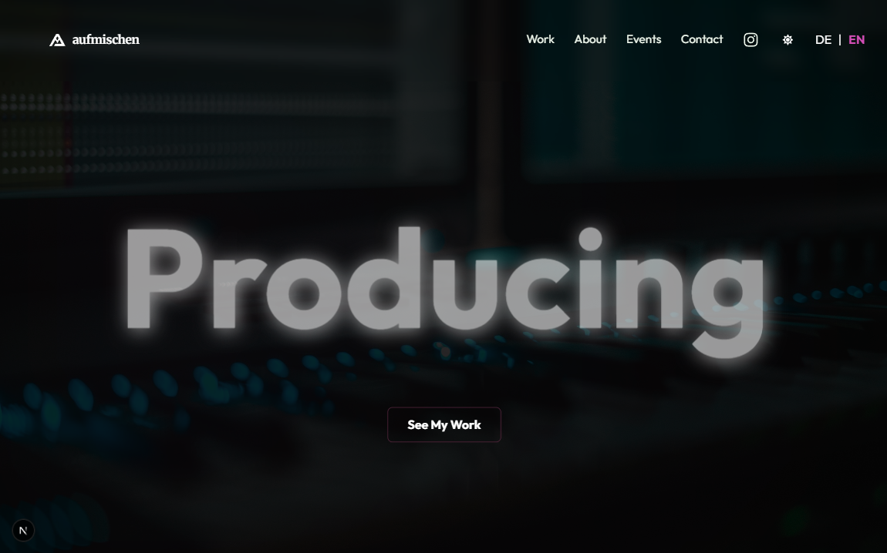
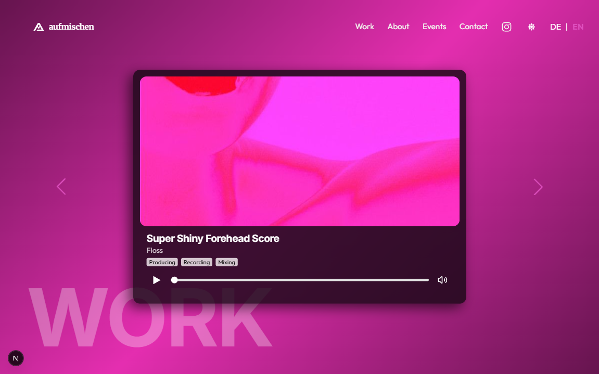
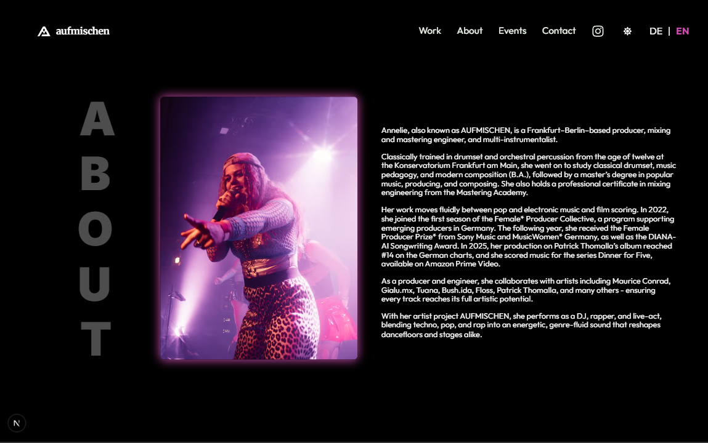
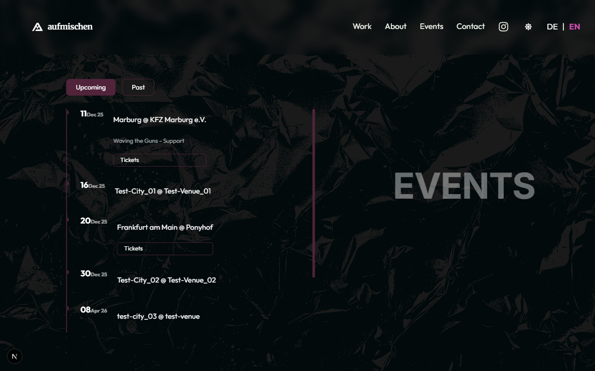
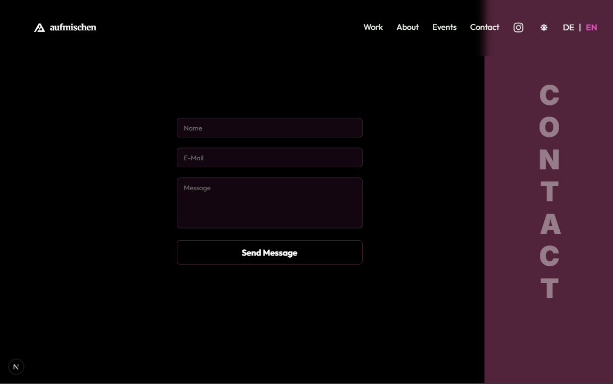

![AUFMISCHEN – Artist Portfolio Engine]

## Table of Contents
- [Short Description](#short-description)
- [Showcase](#showcase)
- [Key Features](#key-features)
- [Technologies Used](#technologies-used)
- [Challenges & Lessons Learned](#challenges--lessons-learned)
- [How to Get Started (Local Setup)](#how-to-get-started-local-setup)
- [Live Demo](#live-demo)
- [Data Source](#data-source)
- [Notes](#notes)

## Short Description
**Welcome to the AUFMISCHEN Artist Portfolio Engine!**  
This is a modern, high-performance web application built for the Frankfurt/Berlin-based music producer and artist **AUFMISCHEN**. 

The project separates the content management from the frontend presentation using a modern **Headless CMS architecture**. It delivers a blazing-fast user experience to showcase musical work, audio references, tour dates, and biographical content.

---

## Showcase

### Screenshots
<p align="center">
  
</p>
<p align="center">
  
</p>
<p align="center">
  
</p>
<p align="center">
  
</p>
<p align="center">
  
</p>

---

## Key Features 

- **Headless CMS Integration:** Content is fully decoupled and dynamically managed using Sanity CMS.
- **Dynamic Work Sektion:** Displays audio references categorized by credits (Producing, Mixing, Mastering).
- **Responsive Modular Design:** Clean layouts for *Work*, *About*, *Events*, and *Contact* sections that adapt smoothly to different screen sizes.
- **Asset Optimization:** Leverages Next.js image optimization pipelines to fetch high-res media smoothly from the Sanity CDN.
- **Event Management Pipeline:** Includes a specialized content schema to dynamically handle upcoming tour dates or DJ live gigs.

---

## Technologies Used 
- **Frontend Framework:** Next.js (React)
- **Content Management:** Sanity CMS (Headless)
- **Styling:** Responsive Layout, CSS Modules
- **Deployment & Hosting:** Vercel

---

## Challenges & Lessons Learned
- **Headless Architecture:** Gained deep experience in decoupling content management from the frontend layer, utilizing structured GROQ queries to fetch CMS data.
- **Next.js Rendering Pipelines:** Optimized page performance and load times by leveraging Next.js-specific rendering strategies and dynamic routing.
- **Asset Delivery:** Implemented smooth synchronization and optimization pipelines for media assets hosted on external CDNs.
- **Scalable Component Modeling:** Developed a reusable layout core that can easily be modified or white-labeled for other musical artists and industry professionals.

---

## How to Get Started (Local Setup)
To run this project locally, follow these steps:

1. Clone the repository:
   ```bash 
   git clone https://github.com/MarcelFelder-git/next-aufmischen_portfolio_v02.git
   ````
   
3. Navigate to the project directory:
   ```bash 
   cd next-aufmischen_portfolio_v02
   ````

5. Install dependencies:
   ```bash 
   npm install
   ````
   
7. Set up Environment Variables:
   Create a file named .env.local in the root directory and insert your Sanity credentials:
   ```bash 
   NEXT_PUBLIC_SANITY_PROJECT_ID=your_sanity_project_id
   NEXT_PUBLIC_SANITY_DATASET=production
   ````
   
9. Start the application:
   ```bash 
   npm run dev
   ````

---

## Live Demo 
You can view the fully functional, deployed application showcase here:  

[AUFMISCHEN Portfolio on Vercel](https://next-aufmischen-portfolio-v03.vercel.app/)

---

## Data Source
All texts, media files, and production credits are fetched live via a secure connection from the [Sanity Content Lake API](https://www.sanity.io/docs/datastore-api). 

---

## Notes
**Project Status Note:** This project was built and finalized up to a 100% production-ready state as a freelance client contract. Due to client-side internal shifts and communication freezes prior to the final domain mapping, the site was not launched publicly under the client's official domain. It stands as a fully operational open-source portfolio showcase of modern web development and Headless CMS integrations.
